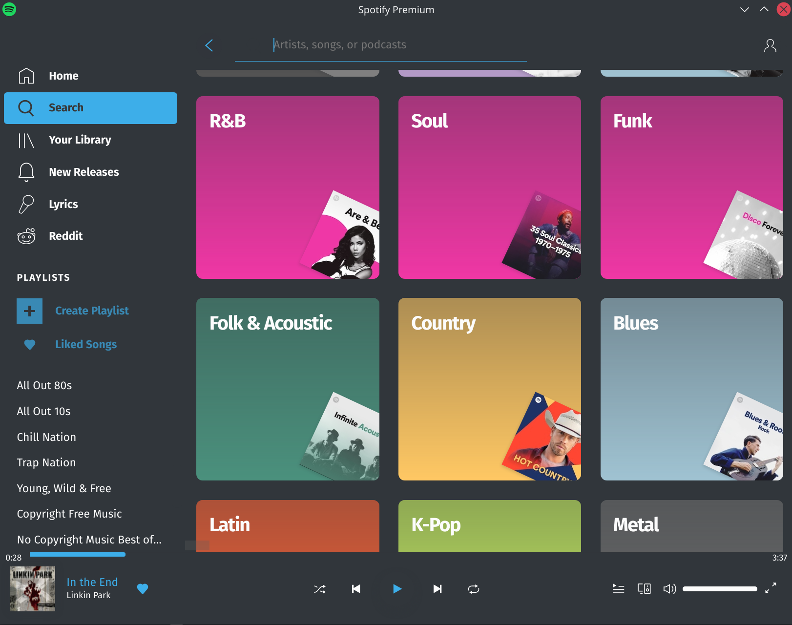

# Spicetify-Breeze-Dark v2

A [Spicetify](https://github.com/khanhas/spicetify-cli) theme based on [Orchis-Colours-v2 theme](https://github.com/canbeardig/Spicetify-Orchis-Colours-v2). Inspired by [Breeze Light theme](https://github.com/morpheusthewhite/spicetify-themes/tree/master/BreezeLight). **New Spotify UI (>v1.1.56) and Spicetify >v2 are required**.

<br/>

## Screenshots



<br/>


### Fonts

Required fonts:
 - Noto Sans Regular
 - Noto Sans Medium
 - Noto Sans Bold

Download and install Noto font family from [Google Fonts](https://fonts.google.com/specimen/Noto+Sans).


#### How to Apply

 - Follow the Spicetify installation guide from [the page](https://github.com/khanhas/spicetify-cli).
 - Move the BreezeDark theme folder to Linux: ```~/.config/spicetify/Themes```, Windows: ```%userprofile%\.spicetify\Themes\```, MacOS: ```~/spicetify_data/Themes```
 - Run the following commands in your Linux Terminal or Windows PowerShell to apply the colours:
 
 ```spicetify config current_theme BreezeDark```
 
 ```spicetify apply```
 
 


